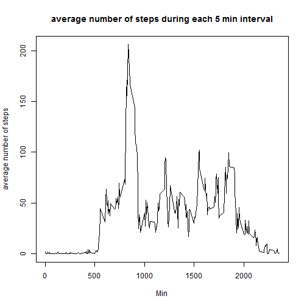

First we must read in the data and add the intervals to the date to form a forth column


```r
activity <- read.csv("activity.csv")
```

Find the mean and Median of the data,

```r
library(plyr)
day_activity <- ddply(activity,.(date),function(x) sum(x$steps))
colnames(day_activity)[2] <- "steps"
hist(day_activity$steps)
```

 

```r
mean(day_activity$steps)
```

```
## [1] NA
```

```r
median(day_activity$steps)
```

```
## [1] NA
```

If we strip the NAs we get the following for the mean

```r
mean(day_activity$steps,na.rm = TRUE)
```

```
## [1] 10766.19
```

```r
median(day_activity$steps,na.rm = TRUE)
```

```
## [1] 10765
```

Now we find out the average number of steps taken in each 5 minute period

```r
min_activity <- ddply(activity, .(interval), function(x) mean(x$steps, na.rm=TRUE))
colnames(min_activity)[2] <- "steps"
plot(min_activity$interval,min_activity$steps, xlab = "Min",main = "average number of steps during each 5 min interval", ylab = "average number of steps", type = "l")
```

 

Find the max time

```r
min_activity$interval[which.max(min_activity$steps)]
```

```
## [1] 835
```


number of NA's

```r
sum(is.na(activity$steps))
```

```
## [1] 2304
```

Replace any NA with the average value for that 5 min interval

```r
nas<- is.na(activity$steps)
average_interval <- tapply(activity$steps, activity$interval, mean,na.rm=TRUE)
activity$steps[nas] <- average_interval[as.character(activity$interval[nas])] 
```

Redo the histogram from earlier with the NA less data

```r
day_activity <- ddply(activity,.(date),function(x) sum(x$steps))
colnames(day_activity)[2] <- "steps"
hist(day_activity$steps)
```

 

```r
mean(day_activity$steps)
```

```
## [1] 10766.19
```

```r
median(day_activity$steps)
```

```
## [1] 10766.19
```

Find add a column for weekend or weekdays

```r
activity <- mutate(activity, weekdayorweekend = ifelse(weekdays(as.Date(activity$date))== "Saturday" | weekdays(as.Date(activity$date)) == "sunday", "Weekend", "Weekday" ))
par(mfrow= c(2,1))
activity_weekday <- subset(activity, weekdayorweekend == "Weekday")
activity_weekend <- subset(activity, weekdayorweekend == "Weekend")

min_activity_weekend <- ddply(activity_weekend, .(interval), function(x) mean(x$steps, na.rm=TRUE))
colnames(min_activity_weekend)[2] <- "steps"
plot(min_activity_weekend$interval,min_activity_weekend$steps, xlab = "Min",main = "weekend", ylab = "average number of steps", type = "l")

min_activity_weekday <- ddply(activity_weekday, .(interval), function(x) mean(x$steps, na.rm=TRUE))
colnames(min_activity_weekday)[2] <- "steps"
plot(min_activity_weekday$interval,min_activity_weekday$steps, xlab = "Min",main = "weekday", ylab = "average number of steps", type = "l")
```

 

Seems people get start moving earlier on Weekdays and stop moving sooner.

